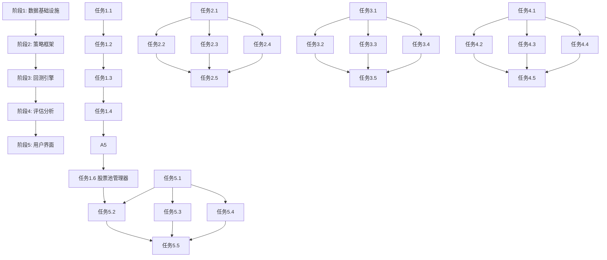

# 股票回测系统任务拆解 (Tasks)

## 项目执行概览

### 总体进度
- **当前阶段**: 阶段1 - 数据基础设施
- **整体进度**: 0% (0/25 任务完成)
- **预计完成时间**: 5周

### 阶段划分
1. **阶段1**: 数据基础设施 (第1周) - 5个任务
2. **阶段2**: 策略框架 (第2周) - 5个任务
3. **阶段3**: 回测引擎 (第3周) - 5个任务
4. **阶段4**: 评估分析 (第4周) - 5个任务
5. **阶段5**: 用户界面 (第5周) - 5个任务

---

## 阶段1：数据基础设施 (第1周)

### 任务1.1：数据源集成 (2天)
**状态**: ⬜ 未开始  
**负责人**: 数据工程师  
**预计完成**: 第1天结束

#### 子任务
- [ ] 1.1.1 研究AKShare API文档和接口
- [ ] 1.1.2 创建数据获取器基础框架 (`src/data/data_fetcher.py`)
- [ ] 1.1.3 实现A股日线数据获取功能
- [ ] 1.1.4 实现API调用异常处理
- [ ] 1.1.5 实现网络请求失败重试机制（最多3次）
- [ ] 1.1.6 添加数据获取日志记录

#### 验收标准
- 能够成功获取任意A股代码的历史日线数据
- 网络异常时能自动重试最多3次
- 数据获取过程有详细日志记录

### 任务1.2：数据库设计 (1天)
**状态**: ⬜ 未开始  
**负责人**: 数据工程师  
**预计完成**: 第2天结束

#### 子任务
- [ ] 1.2.1 设计股票日线数据表结构
- [ ] 1.2.2 设计交易记录表结构
- [ ] 1.2.3 设计回测结果表结构
- [ ] 1.2.4 创建SQLite数据库初始化脚本
- [ ] 1.2.5 实现数据库连接管理器 (`src/common/database.py`)
- [ ] 1.2.6 添加数据库索引优化查询性能

#### 验收标准
- 数据库表结构设计合理，支持高效查询
- 数据库连接管理稳定可靠
- 关键字段有索引优化

### 任务1.3：数据存储实现 (2天)
**状态**: ⬜ 未开始  
**负责人**: 数据工程师  
**预计完成**: 第4天结束

#### 子任务
- [ ] 1.3.1 创建数据存储器基础框架 (`src/data/data_storage.py`)
- [ ] 1.3.2 实现股票数据批量存储功能
- [ ] 1.3.3 实现数据清洗逻辑（处理空值、异常值）
- [ ] 1.3.4 实现数据去重和更新逻辑
- [ ] 1.3.5 添加存储操作事务支持
- [ ] 1.3.6 实现存储性能优化（批量插入）

#### 验收标准
- 数据能够正确存储到SQLite数据库
- 数据清洗逻辑能处理常见异常情况
- 存储操作支持事务回滚

### 任务1.4：数据查询接口 (1天)
**状态**: ⬜ 未开始  
**负责人**: 数据工程师  
**预计完成**: 第5天结束

#### 子任务
- [ ] 1.4.1 创建数据查询器基础框架 (`src/data/data_query.py`)
- [ ] 1.4.2 实现按股票代码查询功能
- [ ] 1.4.3 实现按日期范围查询功能
- [ ] 1.4.4 实现复合条件查询（代码+日期范围）
- [ ] 1.4.5 优化查询性能（索引使用、查询优化）
- [ ] 1.4.6 添加查询结果缓存机制

#### 验收标准
- 能够快速查询指定股票的历史数据
- 查询性能满足要求（单次查询≤1秒）
- 查询结果格式统一，便于后续处理

### 任务1.5：测试验证 (1天)
**状态**: ⬜ 未开始  
**负责人**: 数据工程师  
**预计完成**: 第6天结束

#### 子任务
- [ ] 1.5.1 编写数据获取器单元测试
- [ ] 1.5.2 编写数据存储器单元测试
- [ ] 1.5.3 编写数据查询器单元测试
- [ ] 1.5.4 编写集成测试（获取-存储-查询完整流程）
- [ ] 1.5.5 进行数据完整性验证
- [ ] 1.5.6 进行性能基准测试

#### 验收标准
- 单元测试覆盖率≥80%
- 集成测试通过完整数据流程
- 性能测试达到预期指标

### 任务1.6：股票池管理器 (1天)
**状态**: ⬜ 未开始  
**负责人**: 数据工程师  
**预计完成**: 第7天结束

#### 子任务
- [ ] 1.6.1 研究AKShare指数成分股接口（沪深300、上证50、创业板50、中证500）
- [ ] 1.6.2 创建股票池管理器 (`src/data/stock_pool.py`)
- [ ] 1.6.3 实现各预置股票池成分股获取功能
- [ ] 1.6.4 实现全部A股列表获取功能
- [ ] 1.6.5 实现股票池本地缓存机制（避免频繁请求）
- [ ] 1.6.6 支持自定义股票代码列表（手动输入或文件导入）
- [ ] 1.6.7 实现批量下载管理器 (`src/data/batch_downloader.py`)：并发控制、进度回调、失败重试、失败列表记录
- [ ] 1.6.8 实现增量更新逻辑：本地存在数据时只下载缺失日期

#### 验收标准
- 能够正确获取沪深300、上证50、创业板50成分股列表
- 批量下载300只股票能显示进度并记录失败列表
- 增量更新不重复下载已有历史数据
- 支持自定义股票代码列表

---

## 阶段2：策略框架 (第2周)

### 任务2.1：策略基类设计 (1天)
**状态**: ⬜ 未开始  
**负责人**: 策略工程师  
**预计完成**: 第7天结束

#### 子任务
- [ ] 2.1.1 设计BarData数据结构
- [ ] 2.1.2 设计Signal数据结构
- [ ] 2.1.3 创建策略基类 (`src/trading/strategy.py`)
- [ ] 2.1.4 定义策略标准接口方法
- [ ] 2.1.5 实现策略状态管理（持仓、资金等）
- [ ] 2.1.6 添加策略日志记录功能

#### 验收标准
- 策略基类接口设计清晰合理
- 数据结构定义完整，支持策略需求
- 策略状态管理准确可靠

### 任务2.2：双均线策略实现 (1天)
**状态**: ⬜ 未开始  
**负责人**: 策略工程师  
**预计完成**: 第8天结束

#### 子任务
- [ ] 2.2.1 创建双均线策略类 (`src/trading/strategies/dual_ma.py`)
- [ ] 2.2.2 实现移动平均线计算逻辑
- [ ] 2.2.3 实现金叉死叉信号识别
- [ ] 2.2.4 实现买卖信号生成逻辑
- [ ] 2.2.5 添加策略参数配置支持
- [ ] 2.2.6 实现信号过滤和确认机制

#### 验收标准
- 双均线策略逻辑正确
- 金叉死叉信号识别准确
- 参数配置生效，策略行为可预测

### 任务2.3：布林带策略实现 (1天)
**状态**: ⬜ 未开始  
**负责人**: 策略工程师  
**预计完成**: 第9天结束

#### 子任务
- [ ] 2.3.1 创建布林带策略类 (`src/trading/strategies/bollinger_bands.py`)
- [ ] 2.3.2 实现布林带计算逻辑（中轨、上轨、下轨）
- [ ] 2.3.3 实现价格突破识别逻辑
- [ ] 2.3.4 实现买卖信号生成逻辑
- [ ] 2.3.5 添加策略参数配置支持
- [ ] 2.3.6 实现动态布林带计算

#### 验收标准
- 布林带计算准确
- 价格突破识别正确
- 策略信号生成符合预期

### 任务2.4：RSI策略实现 (1天)
**状态**: ⬜ 未开始  
**负责人**: 策略工程师  
**预计完成**: 第10天结束

#### 子任务
- [ ] 2.4.1 创建RSI策略类 (`src/trading/strategies/rsi.py`)
- [ ] 2.4.2 实现RSI指标计算逻辑
- [ ] 2.4.3 实现超买超卖识别逻辑
- [ ] 2.4.4 实现买卖信号生成逻辑
- [ ] 2.4.5 添加策略参数配置支持
- [ ] 2.4.6 实现RSI信号平滑处理

#### 验收标准
- RSI指标计算准确
- 超买超卖识别正确
- 策略信号生成符合预期

### 任务2.5：策略配置系统 (1天)
**状态**: ⬜ 未开始  
**负责人**: 策略工程师  
**预计完成**: 第11天结束

#### 子任务
- [ ] 2.5.1 创建策略配置管理器 (`src/trading/strategy_config.py`)
- [ ] 2.5.2 实现策略参数配置接口
- [ ] 2.5.3 实现参数验证逻辑
- [ ] 2.5.4 添加配置文件支持
- [ ] 2.5.5 实现策略工厂模式
- [ ] 2.5.6 添加策略配置测试

#### 验收标准
- 策略参数配置接口易用
- 参数验证逻辑完善
- 配置文件格式合理，支持扩展

---

## 阶段3：回测引擎 (第3周)

### 任务3.1：回测引擎框架 (1天)
**状态**: ⬜ 未开始  
**负责人**: 回测工程师  
**预计完成**: 第12天结束

#### 子任务
- [ ] 3.1.1 设计回测引擎架构
- [ ] 3.1.2 创建回测引擎基础类 (`src/backtesting/backtest_engine.py`)
- [ ] 3.1.3 实现回测流程控制逻辑
- [ ] 3.1.4 实现回测状态管理
- [ ] 3.1.5 添加回测进度跟踪
- [ ] 3.1.6 实现回测错误处理机制

#### 验收标准
- 回测引擎架构设计合理
- 流程控制逻辑正确
- 状态管理准确可靠

### 任务3.2：交易执行模块 (1天)
**状态**: ⬜ 未开始  
**负责人**: 回测工程师  
**预计完成**: 第13天结束

#### 子任务
- [ ] 3.2.1 创建交易执行器 (`src/backtesting/executor.py`)
- [ ] 3.2.2 实现交易信号处理逻辑
- [ ] 3.2.3 实现交易订单管理
- [ ] 3.2.4 实现交易执行模拟
- [ ] 3.2.5 添加交易执行日志
- [ ] 3.2.6 实现交易状态跟踪

#### 验收标准
- 交易信号处理正确
- 订单管理准确
- 交易执行模拟符合预期

### 任务3.3：仓位管理系统 (1天)
**状态**: ⬜ 未开始  
**负责人**: 回测工程师  
**预计完成**: 第14天结束

#### 子任务
- [ ] 3.3.1 创建仓位管理器 (`src/backtesting/position_manager.py`)
- [ ] 3.3.2 实现固定比例仓位管理
- [ ] 3.3.3 实现固定金额仓位管理
- [ ] 3.3.4 实现仓位验证逻辑
- [ ] 3.3.5 添加仓位变化跟踪
- [ ] 3.3.6 实现仓位风险控制

#### 验收标准
- 仓位管理逻辑正确
- 仓位验证有效
- 风险控制机制可靠

### 任务3.4：交易成本模型 (1天)
**状态**: ⬜ 未开始  
**负责人**: 回测工程师  
**预计完成**: 第15天结束

#### 子任务
- [ ] 3.4.1 创建成本模型 (`src/backtesting/cost_model.py`)
- [ ] 3.4.2 实现手续费计算逻辑（0.03%）
- [ ] 3.4.3 实现滑点模拟逻辑（0.1%）
- [ ] 3.4.4 实现成本计算验证
- [ ] 3.4.5 添加成本计算日志
- [ ] 3.4.6 实现成本模型配置

#### 验收标准
- 手续费计算准确
- 滑点模拟合理
- 成本计算可验证

### 任务3.5：回测结果计算 (1天)
**状态**: ⬜ 未开始  
**负责人**: 回测工程师  
**预计完成**: 第16天结束

#### 子任务
- [ ] 3.5.1 创建回测结果对象 (`src/backtesting/result.py`)
- [ ] 3.5.2 实现基础绩效指标计算
- [ ] 3.5.3 实现交易记录收集
- [ ] 3.5.4 实现组合价值跟踪
- [ ] 3.5.5 添加回测报告生成
- [ ] 3.5.6 实现结果验证逻辑

#### 验收标准
- 绩效指标计算准确
- 交易记录完整
- 组合价值跟踪正确

---

## 阶段4：评估分析 (第4周)

### 任务4.1：绩效指标计算 (1天)
**状态**: ⬜ 未开始  
**负责人**: 分析工程师  
**预计完成**: 第17天结束

#### 子任务
- [ ] 4.1.1 创建绩效分析器 (`src/analysis/performance_analyzer.py`)
- [ ] 4.1.2 实现年化收益率计算
- [ ] 4.1.3 实现最大回撤计算
- [ ] 4.1.4 实现夏普比率计算
- [ ] 4.1.5 实现胜率计算
- [ ] 4.1.6 实现其他辅助指标计算

#### 验收标准
- 绩效指标计算准确
- 计算结果可验证
- 指标定义符合行业标准

### 任务4.2：可视化组件 (2天)
**状态**: ⬜ 未开始  
**负责人**: 分析工程师  
**预计完成**: 第19天结束

#### 子任务
- [ ] 4.2.1 创建可视化组件 (`src/analysis/visualizer.py`)
- [ ] 4.2.2 实现净值曲线图生成
- [ ] 4.2.3 实现回撤曲线图生成
- [ ] 4.2.4 实现月度收益热力图生成
- [ ] 4.2.5 优化图表样式和布局
- [ ] 4.2.6 添加图表交互功能

#### 验收标准
- 图表生成正确美观
- 图表信息展示清晰
- 图表样式专业规范

### 任务4.3：交易记录导出 (1天)
**状态**: ⬜ 未开始  
**负责人**: 分析工程师  
**预计完成**: 第20天结束

#### 子任务
- [ ] 4.3.1 创建数据导出器 (`src/analysis/exporter.py`)
- [ ] 4.3.2 实现CSV格式导出功能
- [ ] 4.3.3 实现交易记录格式化
- [ ] 4.3.4 实现导出数据验证
- [ ] 4.3.5 添加导出进度跟踪
- [ ] 4.3.6 实现批量导出功能

#### 验收标准
- CSV导出格式正确
- 数据完整性验证通过
- 导出功能稳定可靠

### 任务4.4：分析报告生成 (1天)
**状态**: ⬜ 未开始  
**负责人**: 分析工程师  
**预计完成**: 第21天结束

#### 子任务
- [ ] 4.4.1 创建报告生成器 (`src/analysis/report_generator.py`)
- [ ] 4.4.2 设计分析报告模板
- [ ] 4.4.3 实现自动报告生成
- [ ] 4.4.4 实现报告格式化
- [ ] 4.4.5 添加报告自定义选项
- [ ] 4.4.6 实现报告导出功能

#### 验收标准
- 报告生成完整准确
- 报告格式专业美观
- 自定义选项有效

### 任务4.5：测试验证 (1天)
**状态**: ⬜ 未开始  
**负责人**: 分析工程师  
**预计完成**: 第22天结束

#### 子任务
- [ ] 4.5.1 编写绩效分析器测试
- [ ] 4.5.2 编写可视化组件测试
- [ ] 4.5.3 编写导出功能测试
- [ ] 4.5.4 编写报告生成测试
- [ ] 4.5.5 进行指标计算准确性验证
- [ ] 4.5.6 进行端到端分析流程测试

#### 验收标准
- 单元测试覆盖率≥80%
- 指标计算验证通过
- 端到端测试正常

---

## 阶段5：用户界面 (第5周)

### 任务5.1：界面框架搭建 (1天)
**状态**: ⬜ 未开始  
**负责人**: 前端工程师  
**预计完成**: 第23天结束

#### 子任务
- [ ] 5.1.1 完善PyQt主窗口 (`src/gui/main_window.py`)
- [ ] 5.1.2 设计多标签页布局（数据管理 / 回测配置 / 结果查看）
- [ ] 5.1.3 实现页面导航结构
- [ ] 5.1.4 添加基础样式配置
- [ ] 5.1.5 实现应用状态管理
- [ ] 5.1.6 验证应用启动脚本

#### 验收标准
- 应用界面布局合理，多标签页切换流畅
- 导航结构清晰
- 样式配置美观

### 任务5.2：股票池选择与数据管理界面 (1天)
**状态**: ⬜ 未开始  
**负责人**: 前端工程师  
**预计完成**: 第24天结束

**操作流程**: 用户在此界面完成「第一步：数据管理」，一次性下载整个股票池的行情数据。

#### 子任务
- [ ] 5.2.1 创建数据管理标签页 (`src/gui/data_panel.py`)
- [ ] 5.2.2 实现股票池选择组件（沪深300 / 上证50 / 创业板50 / 中证500 / 全部A股 / 自定义）
- [ ] 5.2.3 实现日期范围选择（开始/结束日期）
- [ ] 5.2.4 实现「下载/更新行情数据」按钮，触发批量下载
- [ ] 5.2.5 实现批量下载进度条（已下载 x/总数，当前股票名称）
- [ ] 5.2.6 实现下载完成后显示失败列表
- [ ] 5.2.7 支持取消下载操作

#### 验收标准
- 股票池选择界面直观，预置池一键选中
- 批量下载进度实时更新
- 失败列表清晰展示，支持单独重试
- 取消操作响应及时

### 任务5.3：策略配置与批量回测控制界面 (1天)
**状态**: ⬜ 未开始  
**负责人**: 前端工程师  
**预计完成**: 第25天结束

**操作流程**: 用户在此界面完成「第二步：批量回测」，选择策略参数和股票池后一键批量回测。

#### 子任务
- [ ] 5.3.1 创建回测配置标签页 (`src/gui/backtest_panel.py`)
- [ ] 5.3.2 实现策略选择下拉框
- [ ] 5.3.3 实现策略参数配置表单
- [ ] 5.3.4 实现回测股票池选择（复用已下载的股票池）
- [ ] 5.3.5 实现回测时间范围选择
- [ ] 5.3.6 实现「开始批量回测」按钮，触发批量回测调度器
- [ ] 5.3.7 实现批量回测进度条（已回测 x/总数）
- [ ] 5.3.8 支持取消批量回测

#### 验收标准
- 策略参数配置验证有效
- 批量回测进度实时更新
- 取消操作响应及时
- 回测完成后自动跳转至结果页

### 任务5.4：批量回测结果汇总界面 (1天)
**状态**: ⬜ 未开始  
**负责人**: 前端工程师  
**预计完成**: 第26天结束

**操作流程**: 用户在此界面完成「第三步：结果汇总展示」，快速浏览所有股票的回测表现。

#### 子任务
- [ ] 5.4.1 创建结果汇总标签页 (`src/gui/result_panel.py`)
- [ ] 5.4.2 实现批量结果汇总表格（每行一只股票，列：代码、名称、总收益率、年化收益率、夏普比率、最大回撤、交易次数）
- [ ] 5.4.3 实现表格列排序功能（点击列头排序）
- [ ] 5.4.4 实现表格筛选功能（如：仅显示收益率>0的股票）
- [ ] 5.4.5 实现点击某行展示该股票详细结果（资产曲线图、交易记录）
- [ ] 5.4.6 实现整体统计卡片（胜率、平均收益率、最佳/最差股票）
- [ ] 5.4.7 实现「导出全部结果到CSV」按钮
- [ ] 5.4.8 优化结果展示布局

#### 验收标准
- 汇总表格数据正确，列排序和筛选正常
- 单股票详情跳转流畅
- 整体统计数据准确
- CSV导出包含所有指标字段

### 任务5.5：用户体验优化 (1天)
**状态**: ⬜ 未开始  
**负责人**: 前端工程师  
**预计完成**: 第27天结束

#### 子任务
- [ ] 5.5.1 优化批量操作的UI响应速度（使用QThread避免主线程阻塞）
- [ ] 5.5.2 完善错误处理机制（下载/回测失败的友好提示）
- [ ] 5.5.3 添加操作引导（首次启动提示先下载数据再回测）
- [ ] 5.5.4 数据管理与回测配置页之间的股票池联动（自动带入已下载的池）
- [ ] 5.5.5 添加帮助提示（Tooltip说明各参数含义）
- [ ] 5.5.6 进行端到端用户体验测试（从选池→下载→回测→查看结果完整流程）

#### 验收标准
- 批量操作期间界面不卡顿
- 错误处理完善，失败信息可读
- 完整操作流程（选池→下载→回测→查看）流畅无阻断

---

## 任务依赖关系

## 风险任务识别

### 高风险任务
1. **任务1.1**: 数据源集成 - 依赖外部API，稳定性不确定
2. **任务3.1**: 回测引擎框架 - 核心组件，复杂度高
3. **任务4.2**: 可视化组件 - 图表生成可能存在性能问题

### 缓解措施
1. **数据源集成**: 提前研究API文档，准备备用方案
2. **回测引擎框架**: 详细设计，分步实现，充分测试
3. **可视化组件**: 选择成熟图表库，优化渲染性能

---

*本文档将实时更新任务状态，团队成员应定期查看最新进度。*